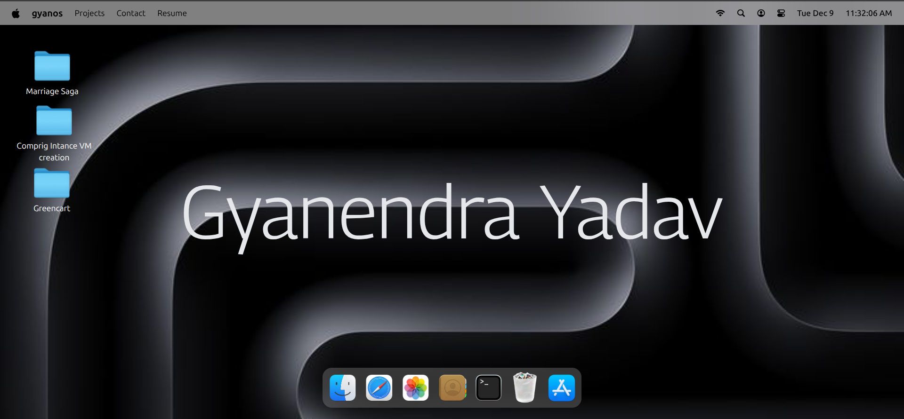
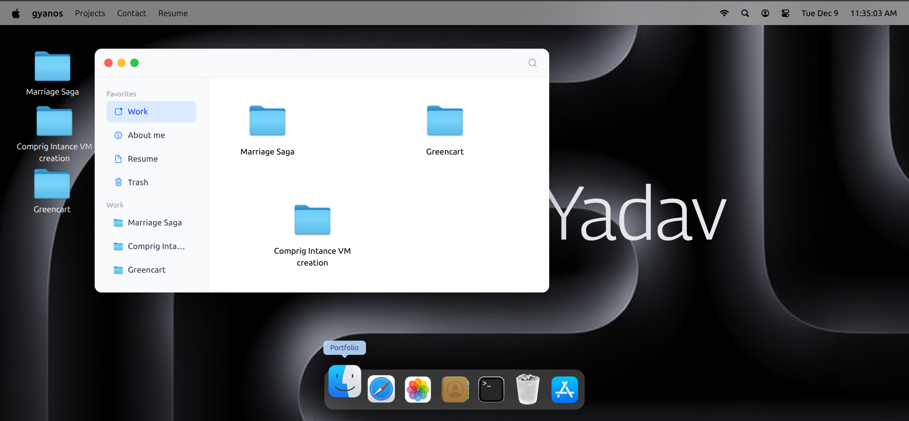
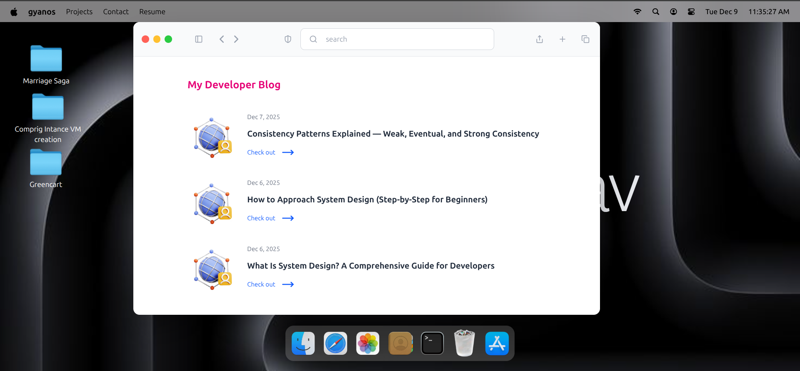
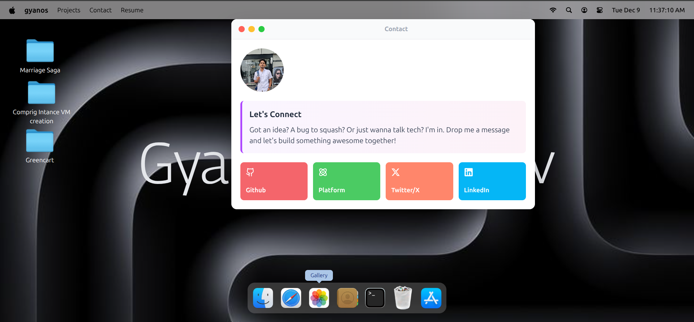
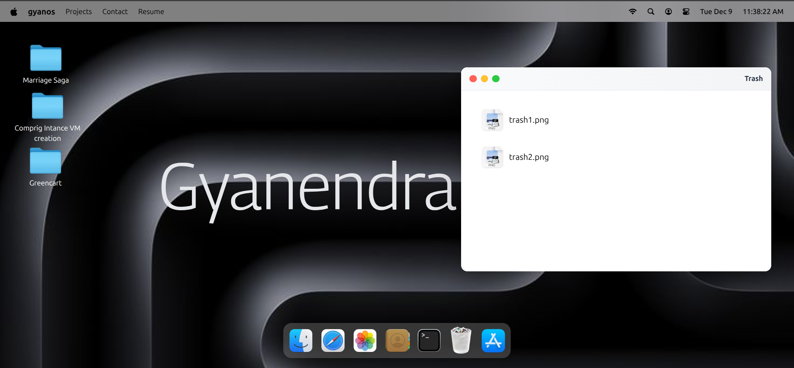
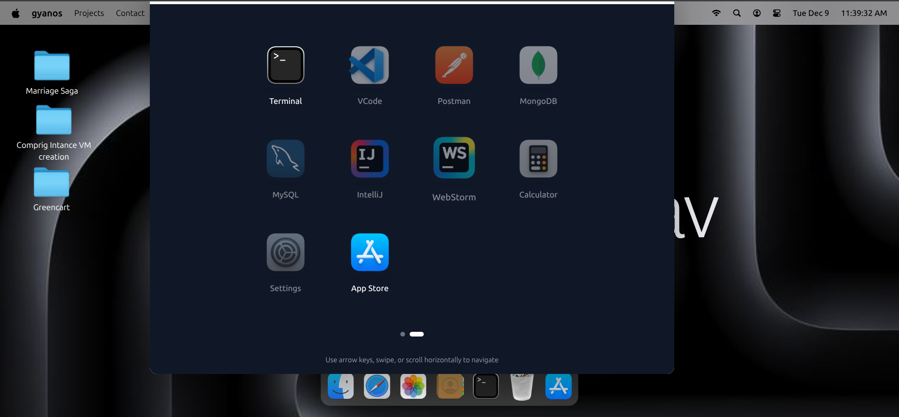

# macOS Portfolio

A stunning interactive portfolio website that replicates the macOS interface, allowing visitors to explore your work through a familiar and engaging desktop environment.


## ✨ Features

- **Authentic macOS Experience**: Fully interactive desktop interface with dock, menu bar, and window management
- **Interactive Applications**: 
  - Finder for exploring projects
  - Terminal for showcasing skills
  - Custom apps for portfolio sections
- **Advanced Window Management**:
  - Drag and reposition windows
  - Minimize, maximize, and close animations
  - Window stacking and focus management
- **Smooth Animations**: GSAP-powered animations for fluid interactions
- **Responsive Design**: Tailwind CSS for beautiful, mobile-friendly layouts
- **State Management**: Zustand for efficient and scalable state handling

## 🚀 Tech Stack

- **React** - UI library for building component-based interface
- **GSAP** - Professional-grade animation library for smooth transitions
- **Tailwind CSS** - Utility-first CSS framework for rapid styling
- **Zustand** - Lightweight state management solution
- **Higher-Order Components (HOC)** - Reusable component logic

## 📦 Installation

1. Clone the repository:
```bash
git clone https://github.com/yourusername/macos-portfolio.git
cd macos-portfolio
```

2. Install dependencies:
```bash
npm install
# or
yarn install
```

3. Start the development server:
```bash
npm run dev
# or
yarn dev
```

4. Open your browser and navigate to `http://localhost:3000`

## 🎨 Project Structure

```
macos-portfolio/
├── public/
├── src/
│   ├── components/
│   │   ├── Dock.jsx
│   │   ├── Home.jsx
│   │   ├── index.js 
│   │   ├── Navbar.jsx
│   │   ├── Welcome.jsx
│   │   └── WindowControlls.jsx
│   ├── constant/
│   │   └── index.js
│   ├── hoc/
│   │   └── WindowWrapper.jsx
│   ├── hooks/
│   │   ├── useCurrentTime.js
│   │   ├── useDockAnimation.js
│   │   ├── useFInder.jsx
│   │   └── useTextHover.js
│   ├── store/
│   │   ├── location.js
│   │   └── window.js
│   ├── windows/
│   │   ├── App.jsx
│   │   ├── Contact.jsx
│   │   ├── Finder.jsx 
│   │   ├── Image.jsx
│   │   ├── index.js
│   │   └── Photos.jsx
│   │   ├── Resume.jsx
│   │   ├── Safari.jsx 
│   │   ├── Terminal.jsx
│   │   ├── Text.jsx
│   │   └── Trash.jsx
│   └── App.jsx
│   └── index.css
│   └── main.jsx
└── .gitignore
└── eslint.config.js
└── index.html
└── jsconfig.json
└── package-lock.json
└── package.json   
└── README.md
└──vite.config.js
```

## 🎯 Key Components

### Window Management
Each application window supports:
- Draggable positioning
- Minimize/Maximize/Close controls
- Focus management and z-index stacking
- Smooth open/close animations

### Dock
- Dynamic app icons
- Hover animations
- Launch applications with smooth transitions
- Active app indicators

### Applications
- **Finder**: Browse through projects and portfolio items
- **Terminal**: Display technical skills and commands
- **Custom Apps**: Add any application to showcase your content

## 🛠️ Customization

### Adding New Applications

1. Create your app component in `src/components/Apps/`
2. Add the app configuration to your store
3. Register the app icon in the Dock component

### Modifying Animations

GSAP animations can be customized in `src/animations/gsap.js`. Adjust timing, easing, and effects to match your style.

### Styling

Tailwind classes can be modified throughout the components. Update `tailwind.config.js` for theme customization.

## 🌟 Features Showcase

- **Smooth Dragging**: Windows can be dragged anywhere on the screen
- **Window Stacking**: Click to bring windows to front with z-index management
- **Dock Magnification**: Hover effect on dock icons (optional)
- **App Launching**: Smooth scale and fade animations when opening apps
- **Minimize Animation**: Windows minimize to dock with GSAP timeline
- **Responsive Layout**: Adapts beautifully to different screen sizes

## 📱 Browser Support

- Chrome (latest)
- Firefox (latest)
- Safari (latest)
- Edge (latest)

## 🤝 Contributing

Contributions are welcome! Please feel free to submit a Pull Request.

1. Fork the project
2. Create your feature branch (`git checkout -b feature/AmazingFeature`)
3. Commit your changes (`git commit -m 'Add some AmazingFeature'`)
4. Push to the branch (`git push origin feature/AmazingFeature`)
5. Open a Pull Request

## 📄 License

This project is licensed under the MIT License - see the [LICENSE](LICENSE) file for details.

## 👤 Author

**Gyanendra Yadav**
- Portfolio: [gyanendra-yadav.vercel.com](https://gyanendra-yadav.vercel.app/work)
- GitHub: [GyanendraYadav7715](https://github.com/GyanendraYadav7715)
- LinkedIn: [Gyanendra Yadav](https://www.linkedin.com/in/gyanendra-yadav-059725253/)

## 🙏 Acknowledgments

- Inspired by macOS Big Sur design
- GSAP for incredible animation capabilities
- React community for excellent tools and libraries

## 📸 Screenshots

Add screenshots of your project here to showcase the interface!












---

⭐ If you found this project helpful, please consider giving it a star!

**Built with ❤️ using React, GSAP, and Tailwind CSS**